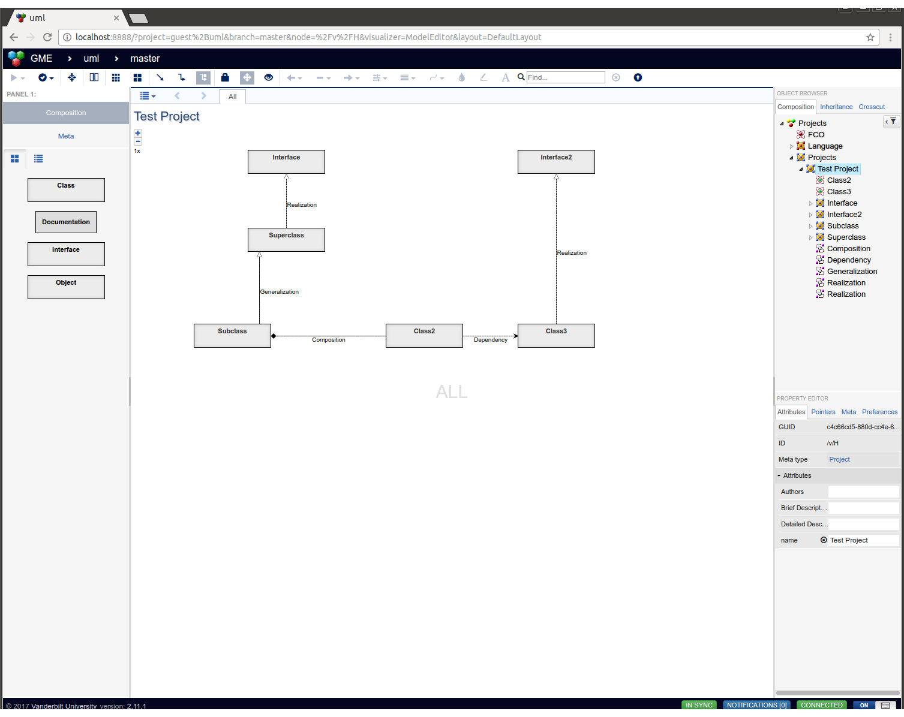

# webgme-uml

This repository contains a representation of UML class diagrams for
creating and synthesizing code from UML Class Diagrams created in
WebGME.

An example ULM class diagram might look like:

To generate c++ code from the UML class diagram, run the CodeGenerator
Plugin.

## Installation
First, install the webgme-uml following:
- [NodeJS](https://nodejs.org/en/) (v4.x.x recommended)
- [MongoDB](https://www.mongodb.com/)

Second, start mongodb locally by running the `mongod` executable in your mongodb installation (you may need to create a `data` directory or set `--dbpath`).

Then, run `webgme start` from the project root to start . Finally, navigate to `http://localhost:8888` to start using webgme-uml!
